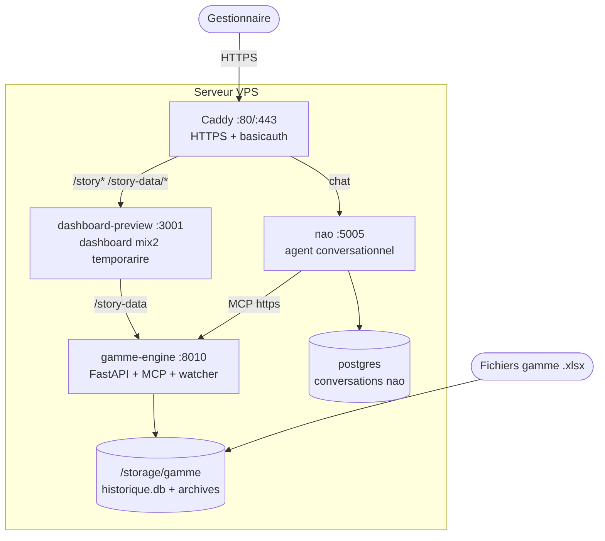
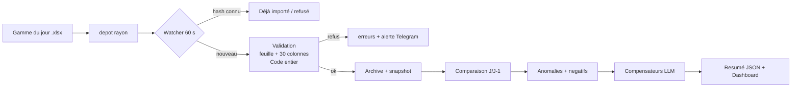

# HyperFix — Agent Gamme

> HyperFix, la fixation — notre raison d'être.

Plateforme complète d'analyse de la gamme du magasin : import quotidien des
fichiers de gamme, détection des stocks négatifs et anomalies, compensateurs
automatiques (heuristique + LLM), exports Excel intelligents, étiquettes,
et dashboard de pilotage — le tout via l'agent conversationnel **nao**,
avec sécurité stricte par rayon.


## Architecture



| Service | Image / Build | Rôle | Port |
|---|---|---|---|
| `postgres` | `postgres:16-alpine` | Base des conversations nao | interne |
| `nao` | `getnao/nao:latest` | Agent conversationnel | `127.0.0.1:5005` |
| `caddy` | `caddy:2-alpine` | Reverse proxy HTTPS + fichiers protégés | `80` / `443` |
| `gamme-engine` | build local (`../gamme-engine`) | Analyse gamme, API + MCP + watcher | `127.0.0.1:8010` |
| `dashboard-preview` | build local (`../dashboard-preview`) | Dashboard mix2 (temporaire, voir § Dashboard) | `127.0.0.1:3001` |

> `nao/` est le code source de l'agent conversationnel ; `nao-gamme/` est la
> configuration métier qui lance nao via l'image `getnao/nao:latest` avec le
> moteur `gamme-engine` en MCP. Seul Caddy est exposé publiquement.

```
HyperFix/
├── nao/                     # Code source complet de l'agent nao (getnao)
├── nao-gamme/               # Config métier + orchestration (docker-compose)
│   ├── docker-compose.yml   # Déploie tout le stack (5 services)
│   ├── Caddyfile            # Reverse proxy (domaines, fichiers, MCP, story)
│   ├── RULES.md             # Règles métier de l'agent (422 règles)
│   ├── import_gamme.sh      # Dépôt manuel d'un fichier (repli)
│   ├── agent/               # Prompts, skills, specs MCP
│   ├── docs/                # Documentations + exports générés
│   └── storage/             # Uploads locaux (exclus de git)
├── gamme-engine/            # Moteur MCP Python (analyse de la gamme)
│   ├── app/                 # API FastAPI + serveur MCP (18 outils)
│   ├── story-ui/            # SPA dashboard (source, non buildée)
│   └── tests/               # Suite pytest (6 fichiers)
└── dashboard-preview/       # Dashboard mix2 servi aujourd'hui (temporaire)
```

## Vie d'un import



1. **Dépôt** : via le chat nao (`gamme_import_file`), `POST /api/upload`, ou
   `./import_gamme.sh fichier.xlsx [rayon]` → `depot/<rayon>/`.
2. **Watcher** (toutes les 60 s, `GAMME_POLL_SECONDS`) : dédoublonnage par
   SHA256 — un fichier déjà traité est retiré, un fichier refusé part en
   `depot/<rayon>/erreurs/` + alerte Telegram.
3. **Validation** : feuille `Gamme_Commande`, 30 colonnes requises, `Code`
   strictement entier (`12.5` rejeté — anti-fausse-jointure), doublons refusés.
   Les valeurs illisibles deviennent des avertissements non bloquants.
4. **Archivage + snapshot** : original horodaté en `imports/<rayon>/AAAA/MM/JJ/`,
   lignes en `article_history` (SQLite `historique.db`). Atomicité garantie :
   tout échec marque l'import `erreur`.
5. **Comparaison J/J-1** : référence = dernier import du même rayon d'un jour
   strictement antérieur (les ré-imports du même jour sont ignorés). Statuts :
   `nouveau`, `persistant_aggrave/stable/ameliore`, `corrige` ; priorité
   `critique` si variation ≤ −10 ou stock ≤ −10.
6. **Anomalies** : `chute_forte` (≤ −200), `hausse_forte` (≥ +200),
   `marge_negative`, `promo_active`.
7. **Compensateurs** : pré-filtre heuristique (top 25), lots LLM de 8 articles
   (plafond 40/jour), repli heuristique si le LLM échoue — toujours signalé.
8. **Livrables** : résumé JSON en base + dashboard mix2 + récap premium dans
   le chat (voir § Récap premium).

> L'import via MCP est **asynchrone** (2 à 5 min) : l'outil répond `demarre`,
> puis on suit avec `gamme_imports` et `gamme_rapports`. Statuts possibles :
> `demarre`, `deja_importe`, `refuse`, `occupe`.

## Fonctionnalités

- **Négatifs journaliers** : nouveaux, persistants (aggravés/stables/améliorés),
  corrigés — avec capital PRMP bloqué/récupéré en FDJ.
- **Récap premium** : 5 graphiques fixes dans le chat (tendance, capital PRMP,
  anomalies, top PRMP, santé stock) + **une seule** Story `recap-<rayon>`
  à 5 onglets, mise à jour sur place (jamais de doublon).
- **Excel intelligent** : matrices articles × jours (marges, stocks, prix,
  couvertures), tris, couleurs, double classement — **vérifiées par relecture**,
  jamais livrées si non conformes.
- **Export historique multi-jours** : tous les jours importés en un appel,
  par mots-clés (FR/EN), en `.xlsx` ou `.csv`.
- **Étiquettes EAN-13** : PDF imprimables, 2 tailles, 10 par page.
- **Recherche produit** : FR/EN, racine courte, multi-passes (jamais de filtre
  stock au premier passage — un produit en rupture se cherche large).
- **Nettoyage de libellés** et **classification hiérarchique officielle**
  (secteur → rayon → famille → sous-famille), validée contre le référentiel.
- **Alertes Telegram** : imports refusés, erreurs inattendues.
- **Sauvegardes quotidiennes** de la base (rétention configurable).
- **Dormants prouvés** : `Couv. = 999` exactement + stock > 0 = capital
  immobilisé, trié par valeur PRMP.
- **Promos** : `PV promo` + période `Date Dbt/Date fin` (JJ/MM/AAAA) ; une promo
  est active quand `date_dbt <= jour <= date_fin`.

## Outils MCP (18, serveur `gamme-engine`)

| Outil | Rôle |
|---|---|
| `gamme_mon_rayon` | Rayons autorisés du gestionnaire (à appeler **avant toute donnée**) |
| `gamme_rayons` | Rayons configurés du magasin |
| `gamme_import_file` | Import d'un fichier en arrière-plan |
| `gamme_imports` | Historique des imports (statut, erreur) |
| `gamme_rapports` | Derniers résumés + indicateurs |
| `gamme_negatifs` | Négatifs du jour + compensateurs |
| `gamme_anomalies` | Anomalies du dernier import |
| `gamme_article` | Historique complet d'un article |
| `gamme_serie` | Série quotidienne complète (tous les jours, KPIs, jours manquants) |
| `gamme_query` | SQL lecture seule sur le jour courant (`total`/`tronque` inclus) |
| `gamme_history_query` | SQL lecture seule sur un jour passé |
| `gamme_history_export` | Export multi-jours en fichier téléchargeable |
| `gamme_excel_intelligent` | Excel pivoté en langage naturel |
| `gamme_recherche_articles` | Recherche produit élargie |
| `gamme_libeller` | Nettoyage de libellés |
| `gamme_structure_articles` | Classification hiérarchique |
| `gamme_etiquettes` | PDF d'étiquettes EAN-13 |
| `gamme_image_article` | Photo produit via EAN |

## API du moteur (gamme-engine)

| Endpoint | Description |
|---|---|
| `GET /healthz` | Sonde (publique, sans auth) |
| `GET /api/status?rayon=` | Moteur + 10 derniers imports (JWT) |
| `GET /api/rayons` | Rayons configurés (JWT) |
| `POST /api/upload` | Dépôt d'un fichier vers `depot/<rayon>/` (JWT) |
| `POST /api/import?path&rayon=` | Import synchrone direct (JWT) |
| `GET /api/article/{code}/historique` | Historique + négatifs d'un article (JWT) |
| `GET /api/article/{code}/compensations` | Compensateurs passés (JWT) |
| `GET /story-data/jours?rayon=` | Jours disponibles (dashboard) |
| `GET /story-data/{jour}?rayon=` | Payload complet du jour (dashboard) |
| `GET /story-data/stats/{jour}?rayon=` | PRMP, santé stock, dormants, corrections (dashboard) |
| `GET /story/*` | Dashboard (protégé, voir ci-dessous) |
| `/mcp` | Serveur MCP streamable (auth token dédiée) |

## Dashboard

Poste de pilotage mix2 (protégé par mot de passe) :
`https://<domaine>/story/dashboard/mix2?jour=<jour>&rayon=<rayon>`

Panneaux : KPIs du jour, négatifs en direct, tendance 90 jours, top capital
PRMP bloqué, anomalies, santé stock (en stock / bas ≤ 7 j / dormants),
mouvements par rayon — avec repli honnête (« données simulées » si l'API
ne répond pas).

> **Note de transparence** : le dashboard servi aujourd'hui est
> `dashboard-preview` (Next.js, marqué temporaire — maquette née sur des
> données mock). La SPA officielle `gamme-engine/story-ui` (React+Vite)
> n'est pas buildée (`dist/` absent) donc pas encore servie. La fusion
> vers une cible unique fait partie de la roadmap.

## Sécurité

- **Rayons stricts** : chaque appel MCP est signé ; `gamme_mon_rayon` fait foi.
  Jamais de rayon deviné, jamais de contournement (`Accès refusé` = voir
  l'administrateur). La vue SQL `article_history` est pré-filtrée jour+rayon,
  et toute référence `main.article_history` est bloquée.
- **Secrets exclus du dépôt** (`.gitignore`) : `.env`, clés API, `storage/`,
  bases DuckDB. La clé LLM est injectée au runtime — aucun secret en clair.
- **Réseau** : `nao` (:5005) et `gamme-engine` (:8010) n'écoutent que sur
  `127.0.0.1` ; seul Caddy (80/443) est public.
- **Caddy** : `basicauth` sur `/rapports`, `/etiquettes`, `/images`,
  `/exports`, `/story-data`, `/story`. Pas d'`encode` global (il bufferise
  le SSE) — gzip seulement sur les assets statiques.
- **Anti-fausse-réponse** (règles dures, voir `RULES.md`) : nombres stockés en
  texte → `CAST AS DOUBLE` ; dates promo comparées via `substr`, jamais en
  texte brut ; liste `tronque:true` annoncée avec son `total`, jamais
  présentée comme complète ; « 0 » interdit sans recoupement — on dit
  « données incomplètes » ; montants en **FDJ**, jamais convertis.
- Pensez à **révoquer toute clé qui aurait déjà été exposée** par le passé.

## Prérequis

- **Docker** ≥ 24 et **Docker Compose** ≥ 2.20
- Une clé API LLM. **Défaut partout : ExperientialLabs** (`luna`, repli
  `deepseek`) — alternatives : OpenCode Zen (gratuit), B.AI, SeekAI.
  Voir `nao-gamme/.env.example` (~25 variables documentées).
- Un domaine (optionnel) pour l'accès public via Caddy.

## Installation pas à pas

### 1. Récupérer le dépôt

```bash
git clone https://github.com/SamalehZen/HyperFix2.git
cd HyperFix2/nao-gamme
```

### 2. Créer le fichier `.env`

```bash
cp .env.example .env
nano .env
```

Renseignez au minimum :

| Variable | Description | Exemple |
|---|---|---|
| `EXPERIENTIAL_API_KEY` | Clé du fournisseur par défaut (obligatoire) | `sk-...` |
| `BETTER_AUTH_SECRET` | Secret de session nao (générez-le) | `openssl rand -base64 32` |
| `POSTGRES_PASSWORD` | Mot de passe de la base (à changer) | — |
| `TELEGRAM_BOT_TOKEN` | Alertes d'import (optionnel) | — |
| `ENABLE_USER_SIGNUP` | `true` à la 1re création de comptes, puis `false` | `true` |

> ⚠️ Le `.env` contient des secrets : il est ignoré par git et n'est **jamais**
> poussé. Ne le commitez pas.

### 3. Lancer la pile

```bash
docker compose up -d --build
```

Docker construit `gamme-engine` et `dashboard-preview`, tire `nao`,
`postgres` et `caddy`, puis démarre les 5 services.

### 4. Vérifier que tout tourne

```bash
docker compose ps
```

Attendu : les 5 services `running` (postgres attendu `healthy`).

```bash
curl -s http://127.0.0.1:8010/healthz       # moteur gamme
curl -s http://127.0.0.1:8010/api/status    # imports (JWT requis si configuré)
```

### 5. Créer le premier compte

1. Ouvrez **http://localhost:5005** (ou votre domaine).
2. Créez le compte gestionnaire (signup actif si `ENABLE_USER_SIGNUP=true`).
3. Passez `ENABLE_USER_SIGNUP=false` puis `docker compose up -d` pour verrouiller.

### 6. Configurer le domaine (optionnel, production)

Éditez `Caddyfile` et remplacez `gestion.hypeer.cloud` par votre domaine
(rapports, étiquettes, images, exports, story : mot de passe requis ;
`/mcp` et `/.well-known` : proxys moteur ; le reste : chat nao).

Caddy obtient automatiquement le certificat HTTPS. Pensez à pointer le DNS de
votre domaine vers le serveur.

## Utilisation

### Importer un fichier de gamme

**A. Via l'agent nao** (recommandé) : déposez le fichier (`.xlsx`, `.xlsm`,
`.csv`) dans le chat ; l'agent appelle `gamme_import_file`, attend ~60 s,
vérifie `gamme_imports` puis `gamme_rapports`, et présente le récap.

**B. Via le script** (repli manuel) :

```bash
cd nao-gamme
./import_gamme.sh /chemin/vers/gamme_du_jour.xlsx [rayon]  # défaut: frais-surgele
```

Le script copie vers le dépôt surveillé, attend le traitement (≤ 3 min),
puis affiche l'état via `/api/status`.

### Récap du jour

Dites `récap`, `fais le point` ou `état du rayon` : 5 graphiques dans le chat
+ Story `recap-<rayon>` mise à jour sur place (voir
`nao-gamme/agent/skills/recap-rayon.md`).

### Scripts moteur utiles

```bash
# Rejouer les compensateurs LLM sur des imports existants
docker compose exec gamme-engine python -m app.backfill_compensations <import_id>
# Recalculer premiere_apparition / jours_consecutifs
docker compose exec gamme-engine python -m app.fix_premiere_apparition
# Re-traiter un jour (nettoie les tables dérivées puis réimporte)
python3 scripts/reprocess-jour.py
```

## Tests

```bash
cd gamme-engine
python -m pytest tests/ -q
```

6 fichiers : `test_pipeline` (validation, J/J-1, anomalies), `test_db`
(dedup hash, filtres rayon), `test_query_guards` (gardes SQL),
`test_compensation` (heuristique + fallback LLM), `test_history_export`,
`test_excel_intelligent` (matrices vérifiées par relecture).
Base isolée (DB temporaire via `conftest.py`) — aucun risque sur la prod.

Côté agent : `nao-gamme/tests/*.yml` (question visuelle, récap premium)
et `nao-gamme/agent/skills/` documentent les comportements attendus.

## Données

- `/storage/gamme/historique.db` — SQLite : `imports`, `article_history`,
  `negatifs_journaliers`, `compensations`, `anomalies`, `rapports`.
- `/storage/gamme/depot/<rayon>/` — boîte d'entrée (+ `erreurs/`).
- `/storage/gamme/imports/<rayon>/AAAA/MM/JJ/` — archives originales.
- `/storage/gamme/backups/AAAA-MM-DD/` — sauvegardes quotidiennes.
- `nao-gamme/gamme.duckdb` — snapshot du dernier import (requêtes agent).
- Rayons actifs : `frais-surgele`, `epicerie-salee` (voir `rayons.json`).

## Roadmap — les mouvements journaliers (V2)

Aujourd'hui HyperFix2 voit la **photo** (le stock). Demain il verra le
**film** : chaque jour, en plus de la gamme, le fichier des mouvements du
rayon — ventes, livraisons, inventaires, retours fournisseur, cessions,
périmés — avec réconciliation exacte
(`stock[J] + mouvements[J] = stock[J+1]`) et, à la clé : CA et marge
**encaissés**, démarque connue/inconnue, dormants **prouvés**, efficacité
des promos.

Spécification complète et validée : `nao-gamme/docs/mouvements-journaliers.md`.

## Commandes utiles

```bash
docker compose logs -f nao          # logs de l'agent
docker compose logs -f gamme-engine # logs du moteur
docker compose restart gamme-engine # redémarrer le moteur
docker compose down                 # arrêter (les données sont conservées)
docker compose down -v              # arrêter ET supprimer les volumes (⚠️)
```

## Dépannage

| Problème | Solution |
|---|---|
| `postgres` n'est pas `healthy` | Vérifiez `POSTGRES_USER/PASSWORD/DB` cohérents dans `.env` |
| Le moteur tourne mais l'agent échoue | Le moteur lit les clés `OPENCODE_ZEN_*` (remappées en `OPENCODE_*`), pas `OPENCODE_API_KEY` directement — vérifiez `.env` |
| L'import rejette le fichier | Colonnes manquantes, `Code` non entier ou doublons — l'agent explique l'erreur ; fichiers refusés en `depot/<rayon>/erreurs/` |
| Import bloqué sur `occupe` | Un autre import tourne pour ce rayon : attendez, vérifiez avec `gamme_imports` |
| Caddy : certificat non obtenu | Le DNS doit pointer vers le serveur avant le 1er démarrage |
| Dashboard « données simulées » | Le moteur ne répond pas : `curl http://127.0.0.1:8010/healthz` puis `docker compose restart gamme-engine` |
| Rapport vide / moteur injoignable | `curl http://127.0.0.1:8010/api/status` puis logs du moteur |
